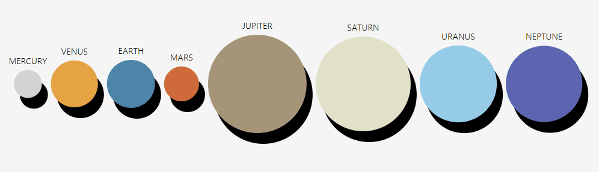
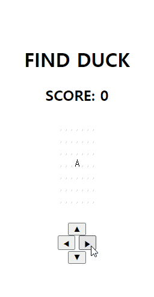
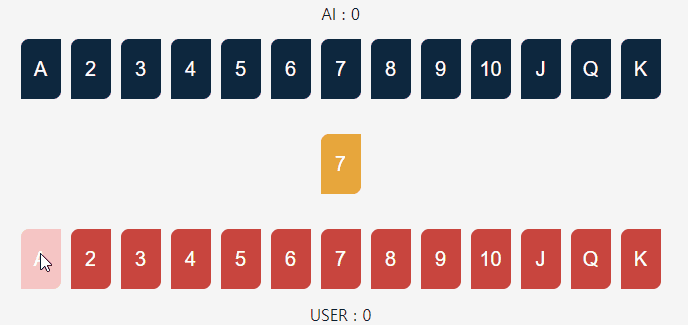
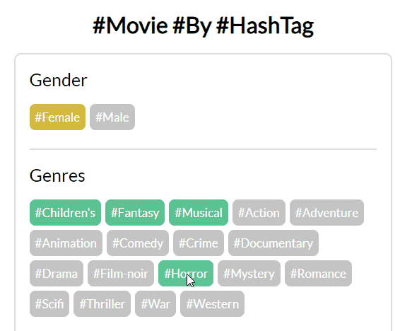

# Project Overview

## Description
`happyhddey`의 `Front-End` Portpolio입니다.  
코드 리뷰 대환영!  
2021.03.24 ~  
 

## Index
+ [Project Overview](#project-overview)
    + [Description](#description)
    + [Index](#index)
+ [Projects](#projects)
    + [Project 1: Solar System](#project-1-solar-system)
    + [Project 2: Find Duck](#project-2-find-duck)
    + [Project 3: Distancing Card Game](#project-3-distancing-card-game)
    + [Project 4: Movie by HashTag](#project-4-movie-by-hashtag)
+ [See More](#see-more)  
 
 

# Projects

## Project 1: Solar System  

`태양계 행성`을 그린 Simple Project  
버튼으로 행성 재정렬 가능: Size, Weight, Alphabetical Order, Distance from the Sun  
`D3.js` 라이브러리 이용  
개발 기간: 2021.03.17 ~ 2021.03.19  
 
 
 

## Project 2: Find Duck  

Simple Map을 돌아다니며 `오리`를 찾는 게임  
지나간 자리는 `#`으로 표시됨  
`version 2`에 Footprint의 색깔이 옅어지는 기능 추가  
`Closure 활용`에 집중한 프로젝트  
`MVC 패턴`을 적용하여 리팩토링 중  
개발 기간: 2021.03.15 ~   
 
 
 

## Project 3: Distancing Card Game  

`AI`와 대결할 수 있는 간단한 `카드 게임`  
Player가 낸 카드와 가운데에 놓여진 기준 카드의 숫자 차이가 해당 턴의 점수가 됨  
이때, Player가 낸 카드는 새로운 기준 카드가 됨  
Final Score는 점수의 누적합    
`AI 구현`에 집중한 프로젝트  
개발 기간: 2021.04.09 ~ 2021.04.13  
 
 
 

## Project 4: Movie by HashTag  

`HashTag`를 바탕으로 영화를 추천해주는 `영화 추천 사이트`  
선택된 해시태그는 앞에서부터 새로 정렬함  
Back-End 개발자와 협업 중이며, 추후 서버와 연동 예정  
`Class 활용`과 `transition`에 집중한 프로젝트  
개발 기간: 2021.05.13 ~   
 
 
 

# See More
This repository is published to Github Pages.  
Please visit [HERE](https://happyhddey.github.io/allaboutfe/index.html).  
 
 
